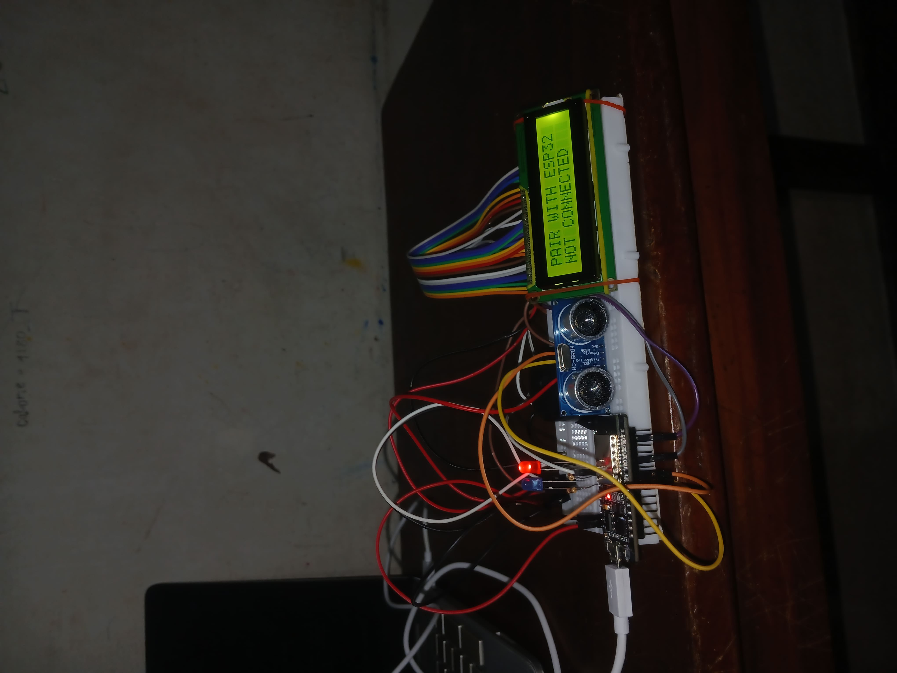
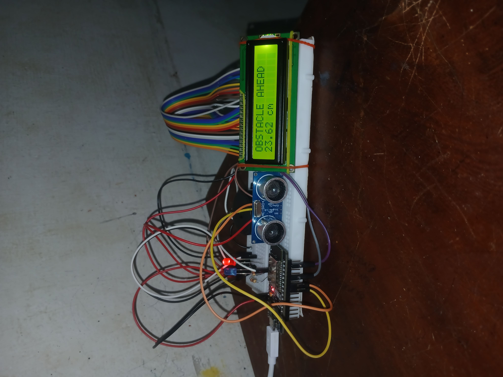

# esp32-ultrasonic-obstacle-detector
Non-blocking obstacle detector using ESP32,HC-SR04 ultrasonic sensor,I2C LCD with Bluetooth telemetry and audio and visual effects.

## FEATURES 
-Non-blocking operation:Uses 'millis()' instead of 'delay()',therefore ensuring smooth operation of the sensor ,LCD,buzzer,LED and bluetooth at the same time.
-Distance measurement:HC-SR04 ultrasonic sensor is capable of measuring distance within the range of 2cm-300cm efficiently.
-Live display:The I2C LCD display shows the distance of obstacle in real time.
-Alerts:Active buzzer and red coloured LED turns on when obstacle is in between the range of 2cm-300cm and blue coloured LED turns on when there is no obstacle in the range of the HCSR04 sensor.
-Bluetooth telemetry:Sends the distance data to the paired phone via bluetooth for monitoring.

## HARDWARE USED 
-ESP32 Devkit
-HC-SR04 Ultrasonic Sensor
-16x2 I2C LCD Display(0x27 address)
-Active Buzzer
-Blue LED+220 ohm resistor
-Red LED+220 ohm resistor
-Breadboard and jumper wires

## HOW TO RUN 
1.Wire the components mentioned below:
-Connect HCSR04,I2C LCD,buzzer and LED's to ESP32 pins  mentioned as macros(VCC is taken as VIN and GND as any GND pin the ESP32 board for all componets) in the code.
-LED's and active buzzer is connected to GPIO pins of the board as mentioned in the code.

2.Install Libraries in Arduino IDE:
-Go to sketch> Include Library> Manage Libraries and install the following:
*'LiquidCrystal_I2C' by Frank de Brabander
*'Wire' comes pre-installed

3.Select board and upload:
-Board:ESP32 Dev Module
-Port:Select your ESP32 COM port
-Click upload

## HIGHLIGHTS 
-Non-blocking timing using 'millis()' instead of 'delay()'
## DEMO

### Working Demo
Click the image below to watch the obstacle detection in action:

### Hardware Setup

**ESP32 + HC-SR04 ultrasonic sensor + 16x2 I2C LCD wired on breadboard**  
LCD shows "NOT CONNECTED" state before pairing via bluetooth.

### Live Test

**LED turns on when obstacle detected within 30cm**

### Serial Output via Bluetooth

**Real-time distance data sent to Serial Bluetooth Terminal app**

## AUTHOR 
Febin Joshy|June 2026

## LICENSE 
MIT License-free to use and modify
