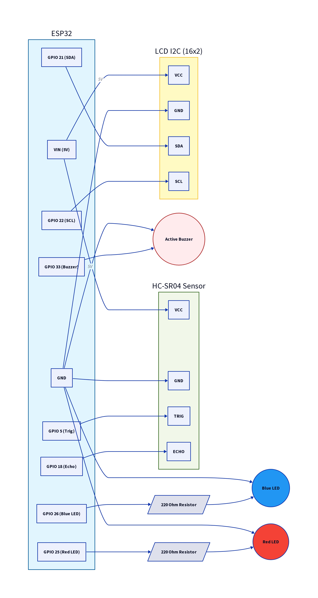

# esp32-ultrasonic-obstacle-detector

Non-blocking obstacle detector using ESP32, HC-SR04 ultrasonic sensor, I2C LCD with Bluetooth telemetry and audio/visual alerts.

## FEATURES

- **Non-blocking operation**: Uses `millis()` instead of `delay()`, ensuring smooth operation of sensor, LCD, buzzer, LED, and Bluetooth at the same time.
- **Distance measurement**: HC-SR04 ultrasonic sensor measures distance from 2cm to 300cm.
- **Live display**: I2C LCD shows real-time distance readings.
- **Alerts**: Active buzzer and red LED turn on when obstacle is detected. Blue LED turns on when no obstacle is in range.
- **Bluetooth telemetry**: Sends distance data to a paired phone via Bluetooth for live monitoring.

## HARDWARE USED

- ESP32 DevKit
- HC-SR04 Ultrasonic Sensor
- 16x2 I2C LCD Display (0x27 address)
- Active Buzzer
- Blue LED + 220 ohm resistor
- Red LED + 220 ohm resistor
- Breadboard and jumper wires

## HOW TO RUN

1. **Wire the components**
   - Connect HC-SR04, I2C LCD, buzzer, and LEDs to ESP32 pins shown in the circuit diagram.
   - VCC → VIN, GND → GND on ESP32 for all components.
   - LEDs and active buzzer connect to GPIO pins as mentioned in the code.

2. **Install libraries in Arduino IDE**
   - Go to `Sketch > Include Library > Manage Libraries`.
   - Install `LiquidCrystal_I2C` by Frank de Brabander.
   - `Wire` library comes pre-installed.

3. **Select board and upload**
   - Board: ESP32 Dev Module
   - Port: Select your ESP32 COM port
   - Click Upload

## HIGHLIGHTS

- Non-blocking timing using `millis()` instead of `delay()`

## DEMO

### Working Demo
Click the image below to watch the obstacle detection in action:

### Hardware Setup

**ESP32 + HC-SR04 ultrasonic sensor + 16x2 I2C LCD wired on breadboard**  
LCD shows "NOT CONNECTED" state before pairing via Bluetooth.

### Circuit Diagram

**Circuit Diagram labeled with all components essential for the non-blocking ultrasonic obstacle detector**

### Live Test

**LED turns on when obstacle detected within 30cm**

### Serial Output via Bluetooth

**Real-time distance data sent to Serial Bluetooth Terminal app**

## AUTHOR

Febin Joshy | June 2026
